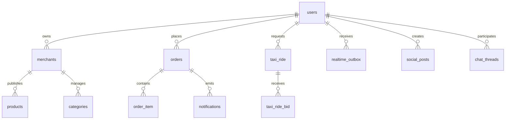

# ERD

Conceptual domain map - not yet validated against physical foreign keys.

## Confirmed Physical Relationships

- `merchant.id` is referenced by `pharmacy_conversation.merchant_id`.
- `app_user.id` is referenced by `pharmacy_conversation.customer_user_id`, `pharmacy_proposed_cart.created_by_user_id`, `pharmacy_attachment.uploader_user_id`, `pharmacy_message.sender_user_id`, `pharmacy_attachment_access_audit.actor_user_id`, and `pharmacy_conversation_event_history.actor_user_id`.
- `customer_order.id` is referenced by `pharmacy_conversation.linked_order_id`.
- `pharmacy_conversation.id` is referenced by `pharmacy_proposed_cart.conversation_id`, `pharmacy_attachment.conversation_id`, `pharmacy_message.conversation_id`, and `pharmacy_conversation_event_history.conversation_id`.
- `pharmacy_proposed_cart.id` is referenced by `pharmacy_proposed_cart_item.proposed_cart_id` and `pharmacy_message.proposed_cart_id`.
- `pharmacy_attachment.id` is referenced by `pharmacy_message.attachment_id` and `pharmacy_attachment_access_audit.attachment_id`.
- `customer_order.pharmacy_conversation_id` references `pharmacy_conversation.id`.
- `pharmacy_retention_job_run` is a standalone tracking table without outward application FKs in the current snapshot.

## Conceptual Relationships

- `users` own `merchants`, place `orders`, request `taxi_ride`, publish social content, and participate in chat threads.
- `merchants` publish `products` and manage `categories`.
- `orders` contain `order_item` rows and emit notifications.
- `taxi_ride` receives `taxi_ride_bid` rows.
- `realtime_outbox` fans out platform events to users.
- `pharmacy` conversations bridge customer and merchant commerce workflows without changing the core order or delivery schemas.

## Unverified Relationships

- Any edge that looks like an integration path rather than a catalog FK.
- Notification emission from domain tables not listed above.
- Taxi ride assignment and chat linkage.
- Social content fan-out and read-model relationships.

## Tables Requiring Phase 1/4 Inspection

- `merchants`
- `categories`
- `products`
- `orders`
- `order_item`
- `taxi_ride`
- `taxi_ride_bid`
- `notifications`
- `realtime_outbox`
- `pharmacy_conversation`
- `pharmacy_proposed_cart`
- `pharmacy_proposed_cart_item`
- `pharmacy_attachment`
- `pharmacy_message`
- `pharmacy_attachment_access_audit`
- `pharmacy_conversation_event_history`
- `pharmacy_retention_job_run`
- `social_posts`
- `chat_threads`
- any reporting or materialized read tables added later
