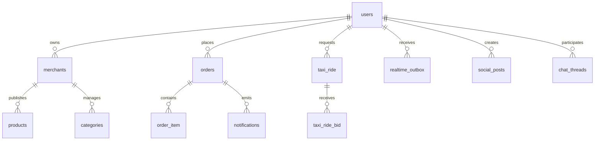

# ERD

Conceptual domain map - not yet validated against physical foreign keys.

## Confirmed Physical Relationships

- `company.id` is referenced by `company_user.company_id`, `company_default_policy.company_id`, `company_branch_request.company_id`, `company_audit_log.company_id`, `coupon.company_id`, `company_coupon_target.company_id`, `company_campaign.company_id`, and `inventory_settings.company_id`.
- `company.created_by_user_id` and `company.updated_by_user_id` reference `app_user.id`.
- `company_user.user_id` references `app_user.id`, and `company_user.invited_by_user_id` also references `app_user.id`.
- `company_default_policy.updated_by_user_id` references `app_user.id`.
- `company_branch_request.reviewed_by_user_id` and `company_branch_request.created_by_user_id` reference `app_user.id`, while `company_branch_request.approved_merchant_id` references `merchant.id`.
- `company_audit_log.actor_user_id` references `app_user.id`.
- `coupon.company_id` references `company.id`, `company_coupon_target.coupon_id` references `coupon.id`, and `company_coupon_target.merchant_id` references `merchant.id`.
- `company_campaign.company_id`, `company_campaign.created_by_user_id`, and `company_campaign.updated_by_user_id` reference `company.id` / `app_user.id`; `company_campaign_target.company_campaign_id` references `company_campaign.id` and `company_campaign_target.merchant_id` references `merchant.id`.
- `inventory_settings.merchant_id` references `merchant.id`; `inventory_settings.company_id` references `company.id`; `inventory_settings.updated_by_user_id` references `app_user.id`.
- `store_inventory_item.merchant_id` and `store_inventory_item.product_id` reference `merchant.id` and `product.id`; `store_inventory_item.updated_by_user_id` references `app_user.id`.
- `inventory_daily_check.merchant_id` references `merchant.id`, and `inventory_daily_check.confirmed_by_user_id` references `app_user.id`.
- `merchant_billing_profile.merchant_id` references `merchant.id`; `merchant_billing_profile.updated_by_user_id` references `app_user.id`.
- `merchant_billing_profile_audit.merchant_id` references `merchant.id`; `merchant_billing_profile_audit.changed_by_user_id` references `app_user.id`.
- `merchant_receivables_ledger.merchant_id` references `merchant.id`, and `merchant_receivables_ledger.order_id` references `customer_order.id`.
- `merchant_payment_request.merchant_id` references `merchant.id`; `merchant_payment_request.reviewed_by_user_id` references `app_user.id`.
- `merchant_payment_allocation.payment_request_id` references `merchant_payment_request.id`.
- `merchant_receivable_invoice.merchant_id` references `merchant.id`, and `merchant_receivable_invoice.order_id` references `customer_order.id`.
- `merchant_payment_invoice_allocation.payment_request_id` references `merchant_payment_request.id` and `merchant_payment_invoice_allocation.receivable_invoice_id` references `merchant_receivable_invoice.id`.
- `merchant_settlement.merchant_id` references `merchant.id`, `merchant_settlement.owner_user_id` references `app_user.id`, and `merchant_settlement.approved_by_user_id` references `app_user.id`.
- `delivery_cash_settlement.merchant_id`, `delivery_cash_settlement.delivery_user_id`, `delivery_cash_settlement.store_cash_confirmed_by_user_id`, and `delivery_cash_settlement.received_by_user_id` reference `merchant.id` / `app_user.id`.
- `merchant_cash_ledger_entry.merchant_id` references `merchant.id`; `merchant_cash_ledger_entry.order_id` references `customer_order.id`; `merchant_cash_ledger_entry.source_delivery_user_id`, `merchant_cash_ledger_entry.source_settlement_id`, and `merchant_cash_ledger_entry.created_by_user_id` reference `app_user.id` / `delivery_cash_settlement.id`.
- `merchant.id` is referenced by `pharmacy_conversation.merchant_id`.
- `app_user.id` is referenced by `pharmacy_conversation.customer_user_id`, `pharmacy_proposed_cart.created_by_user_id`, `pharmacy_attachment.uploader_user_id`, `pharmacy_message.sender_user_id`, `pharmacy_attachment_access_audit.actor_user_id`, and `pharmacy_conversation_event_history.actor_user_id`.
- `customer_order.id` is referenced by `pharmacy_conversation.linked_order_id`.
- `pharmacy_conversation.id` is referenced by `pharmacy_proposed_cart.conversation_id`, `pharmacy_attachment.conversation_id`, `pharmacy_message.conversation_id`, and `pharmacy_conversation_event_history.conversation_id`.
- `pharmacy_proposed_cart.id` is referenced by `pharmacy_proposed_cart_item.proposed_cart_id` and `pharmacy_message.proposed_cart_id`.
- `pharmacy_attachment.id` is referenced by `pharmacy_message.attachment_id` and `pharmacy_attachment_access_audit.attachment_id`.
- `customer_order.pharmacy_conversation_id` references `pharmacy_conversation.id`.
- `pharmacy_retention_job_run` is a standalone tracking table without outward application FKs in the current snapshot.

## Conceptual Relationships

- `users` own `merchants`, place `orders`, request `taxi_ride`, publish social content, and participate in chat threads.
- `merchants` publish `products` and manage `categories`.
- `orders` contain `order_item` rows and emit notifications.
- `taxi_ride` receives `taxi_ride_bid` rows.
- `realtime_outbox` fans out platform events to users.
- `pharmacy` conversations bridge customer and merchant commerce workflows without changing the core order or delivery schemas.

## Unverified Relationships

- Any edge that looks like an integration path rather than a catalog FK.
- Notification emission from domain tables not listed above.
- Taxi ride assignment and chat linkage.
- Social content fan-out and read-model relationships.

## Tables Requiring Phase 1/4 Inspection

- `company`
- `company_user`
- `company_default_policy`
- `company_branch_request`
- `company_audit_log`
- `coupon`
- `company_coupon_target`
- `company_campaign`
- `company_campaign_target`
- `inventory_settings`
- `inventory_daily_check`
- `store_inventory_item`
- `merchant_billing_profile`
- `merchant_billing_profile_audit`
- `merchant_receivables_ledger`
- `merchant_payment_request`
- `merchant_payment_allocation`
- `merchant_receivable_invoice`
- `merchant_payment_invoice_allocation`
- `merchant_settlement`
- `delivery_cash_settlement`
- `merchant_cash_ledger_entry`
- `merchants`
- `categories`
- `products`
- `orders`
- `order_item`
- `taxi_ride`
- `taxi_ride_bid`
- `notifications`
- `realtime_outbox`
- `pharmacy_conversation`
- `pharmacy_proposed_cart`
- `pharmacy_proposed_cart_item`
- `pharmacy_attachment`
- `pharmacy_message`
- `pharmacy_attachment_access_audit`
- `pharmacy_conversation_event_history`
- `pharmacy_retention_job_run`
- `social_posts`
- `chat_threads`
- any reporting or materialized read tables added later
