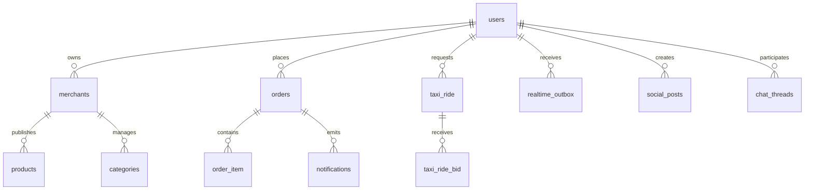

# ERD

Conceptual domain map - not yet validated against physical foreign keys.

## Confirmed Physical Relationships

- None are fully validated in Phase 0 yet.
- Phase 1 / Phase 4 will expand this section from the actual SQL catalog and applied migrations.

## Conceptual Relationships

- `users` own `merchants`, place `orders`, request `taxi_ride`, publish social content, and participate in chat threads.
- `merchants` publish `products` and manage `categories`.
- `orders` contain `order_item` rows and emit notifications.
- `taxi_ride` receives `taxi_ride_bid` rows.
- `realtime_outbox` fans out platform events to users.

## Unverified Relationships

- Any edge that looks like an integration path rather than a catalog FK.
- Notification emission from domain tables.
- Taxi ride assignment and chat linkage.
- Social content fan-out and read-model relationships.

## Tables Requiring Phase 1/4 Inspection

- `merchants`
- `categories`
- `products`
- `orders`
- `order_item`
- `taxi_ride`
- `taxi_ride_bid`
- `notifications`
- `realtime_outbox`
- `social_posts`
- `chat_threads`
- any reporting or materialized read tables added later
