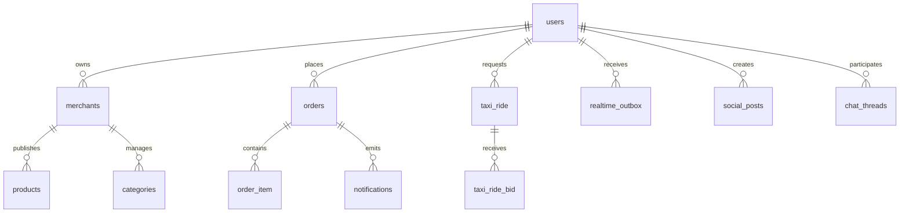

# ERD

This is the initial high-level ERD sketch for the closure program.

## Notes

- This sketch is intentionally high level.
- The detailed relationship map will be expanded as Phase 1 inventory grows.

